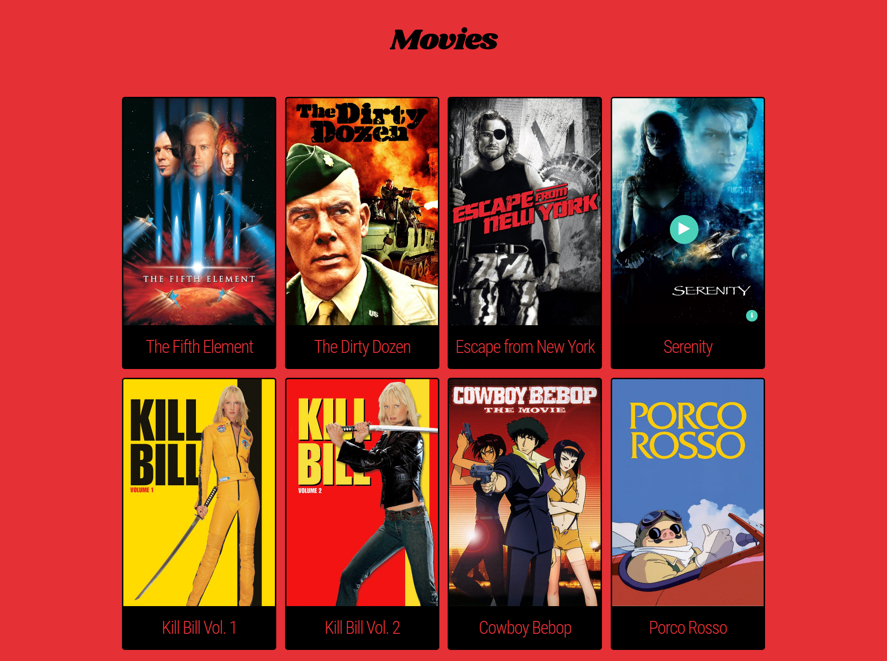

# fsnd_p0_movie_trailer_website
Project #0 of the Udacity FSND.

This project was developed for and requires python 2.7.

All development and testing was done on Linux (elementary OS 0.4 / Ubuntu 16.04), running the project under Windows was not tested, but effort was made to make sure it should run.

A modern browser (IE 11 / Edge, current versions of Chrome / Firefox / Safari) is required to view the site.

## Download and Setup

### Download
To download this project either:
- Clone this repo with `git clone https://github.com/arccoza/fsnd_p0_movie_trailer_website.git`
- Or download it as an archive from [here](https://github.com/arccoza/fsnd_p0_movie_trailer_website/archive/master.zip) and unzip.

### Setup
Once you have the project in the `fsnd_p0_movie_trailer_website` directory (or wherever you put it) setup a Python environment (optional), then install the dependencies, like so:

#### Python environment (optional)
1. From the command line in the fsnd_p0_movie_trailer_website directory, type: `virtualenv -p python2 .env`
2. Activate the environment in this console with `source .env/bin/activate`

#### Install required packages
- From the command line in the fsnd_p0_movie_trailer_website directory, type: `pip install -r requirements.txt`

## Building and Running

To access the Movie Trailers site:

0. Make sure your python environment is active (optional).
1. Build the site by running `python build.py` (this may take a moment) from the command line in the fsnd_p0_movie_trailer_website directory.
2. Access the site by running the http server `python server.py`
3. Open your browser to `localhost:8000`

If everything worked you should see something like:

## Usage

Hover over movie posters to see the **play** and **info** buttons. Click on the **play** button to view a trailer. Click on the small **info** button to read a plot overview.
